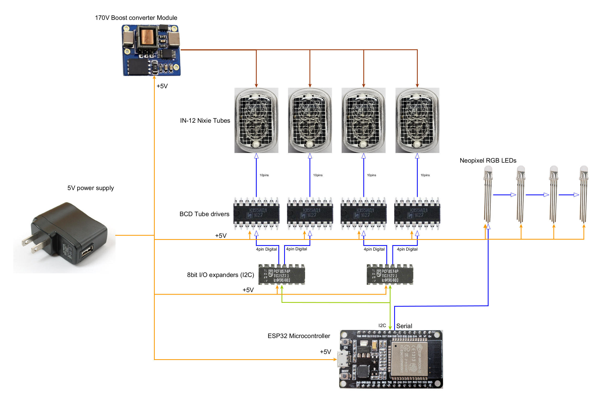

# Nixie Clock

A retro-style digital clock built with nixie tubes and an ESP32 microcontroller, custom built to fit into the scrap metal remains of an X-ray Tube.

## Features

- **Nixie Tube Display**: Classic nixie tube display showing time in HHMM format
- **2x Custom PCBs**: Designed to retrofit the X-ray Tube shell
- **RGB LED Backlight**: RGB LEDs behind each tube for added colour and dazzle
- **ESP32 Microcontroller**: Powered by an ESP32 Wroom32 microcontroller dev board
- **WiFi Time sync**: Daily time sync using wifi NTP to correct against clock drift and daylight savings
- **Cathode Protection**: daily nixie tube conditioning to prevent cathode poisoning

## Block Diagram

See [docs/design/](docs/Nixie clock block diagram rev2.png) for the detailed block diagram and architecture information.

## Hardware

### Main Components

- **Microcontroller**: ESP32 Wroom32 DevKit-C
- **Nixie Tubes**: 4x IN-12 display
- **I/O Expansion**: 2x PCF8574 I2C I/O expanders
- **Decoders**: K155ID1 BCD-to-decimal decoders
- **Brightness Control**: Light Dependent Resistor (LDR)
- **Decoration LEDs**: 4x PL9823 RGB LEDs
- **High Voltage Supply**: NCH8200HV Nixie Power Booster Module

### Custom PCBs

The project includes Two custom PCB designs:

1. **NixieClock_ControlDaughterBoard**: Main control board with ESP32, HV Supply and LEDs
2. **NixieClock_NixieTubePanel**: Nixie tube display panel with decoder logic

### GPIO Pin Configuration

| Pin | Function |
|-----|----------|
| 4   | SDA1 (I2C Bus 1) |
| 15  | SCL1 (I2C Bus 1) |
| 21  | SDA2 (I2C Bus 2) |
| 22  | SCL2 (I2C Bus 2) |
| 19  | INT2 (Interrupt, unused) |
| 32  | RGB LED (NeoPixel) |
| 23  | HV Enable (High Voltage supply) |
| 33  | LDR (Analog input) |

